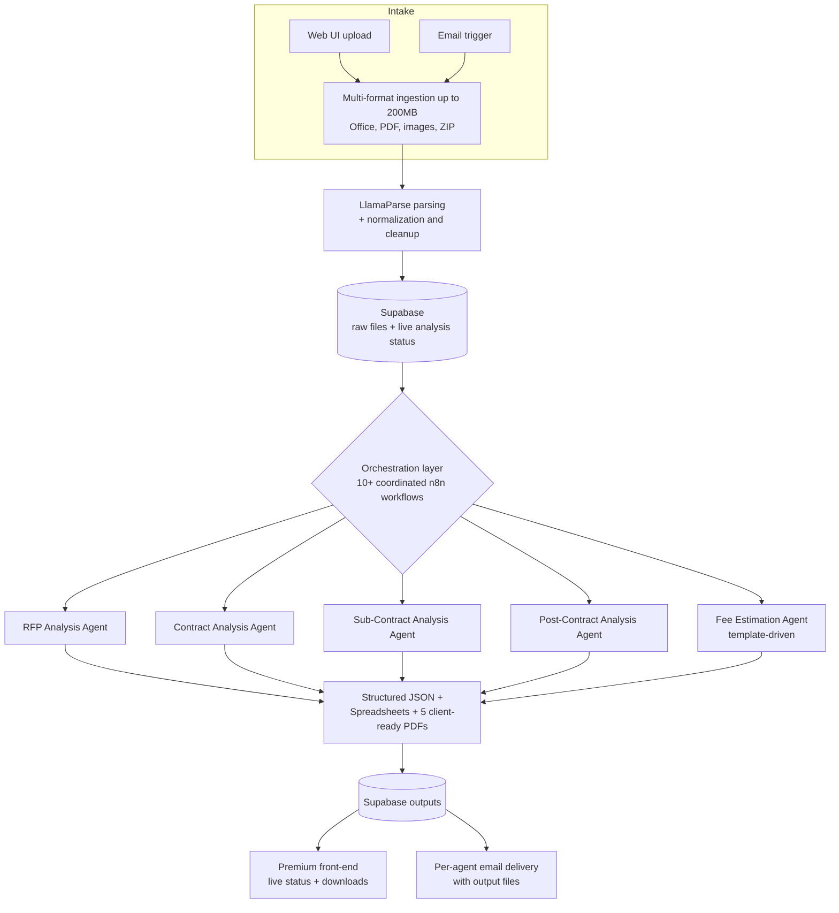

# DSA &ndash; Multi-Agent RFP Intelligence Platform

**Role:** Lead Backend &amp; AI Architect &nbsp;|&nbsp; **Domain:** Construction &amp; Architecture &nbsp;|&nbsp; **Status:** Production

---

## The problem

Construction and architecture firms receive enormous, messy RFP (Request for Proposal) packages: hundreds of pages spread across Office documents, PDFs, scanned images, and ZIP archives. Analysts manually read every file, assess contract and sub-contract risk, evaluate it against frameworks like FIDIC, and hand-build fee estimates. A single RFP can consume **multiple days of senior analyst time**, and the work is inconsistent, slow, and impossible to scale across a pipeline of bids.

## The solution

**DSA** is an end-to-end, multi-agent platform that ingests an entire RFP package in any format, understands it, and autonomously produces a full suite of client-ready analyses. It can be triggered from a premium web UI **or by email**, and every specialized sub-agent returns its results and output files automatically.

## Architecture

## How it works

1. **Ingestion** &ndash; Accepts document sets up to **200&nbsp;MB** across every common format (Office, PDF, images, ZIP), triggered from the UI or by email.
2. **Parsing** &ndash; Routes documents through **LlamaParse** and a normalization layer that turns unstructured content into clean, machine-readable text.
3. **State management** &ndash; Persists raw files and a **live analysis status** to Supabase, so the front-end reflects progress in real time.
4. **Multi-agent analysis** &ndash; An orchestration layer of **10+ coordinated n8n workflows** dispatches five specialized LLM sub-agents: RFP, Contract, Sub-Contract, Post-Contract, and a template-driven Fee Estimation agent.
5. **Deliverables** &ndash; Produces structured JSON, spreadsheets, and **five client-ready PDFs**, stored back in Supabase and surfaced on the front-end and over email.

## Impact

| Metric | Result |
|--------|--------|
| Manual analyst time per RFP | Compressed from **~2&ndash;3 days to under ~30 minutes** end to end *(illustrative)* |
| Max document payload | **200&nbsp;MB**, any common format |
| Specialized analysis agents | **5** (RFP, Contract, Sub-Contract, Post-Contract, Fee Estimation) |
| Client-ready outputs per run | **5 PDFs + spreadsheets + structured JSON** |
| Orchestrated workflows | **10+** coordinated n8n workflows |
| Trigger modes | Web UI **and** email, fully autonomous to delivery |

## Engineering decisions

- **Multi-agent over monolith:** isolating each analysis type into its own sub-agent keeps prompts focused, makes outputs auditable, and lets agents run and fail independently.
- **Status-first persistence:** writing live status to Supabase before heavy processing means the UI never blocks and long runs stay observable.
- **Self-hosted orchestration:** running on self-hosted n8n + Docker keeps large-file processing and data inside controlled infrastructure rather than rate-limited SaaS.

---

> **Confidential.** Production source is proprietary and under NDA. A live, screen-shared walkthrough of the running system is available on request.

[&larr; Back to portfolio](../README.md)
