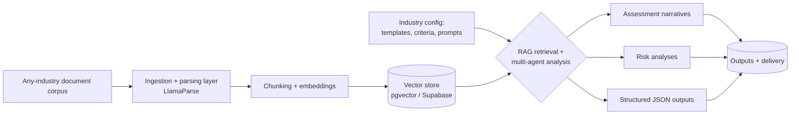

# HaloRFP &ndash; Industry-Agnostic Document Intelligence Engine

**Role:** Lead Backend &amp; AI Architect &nbsp;|&nbsp; **Domain:** Cross-industry SaaS &nbsp;|&nbsp; **Status:** Production

---

## The problem

The document-intelligence pipeline behind [DSA](./01-dsa-rfp-intelligence-platform.md) was purpose-built for construction RFPs. But the same core need (ingest a large, messy document corpus, understand it, and generate structured assessments and risk narratives) exists in **every document-heavy industry**: legal, finance, insurance, procurement, healthcare, and more. The challenge was to generalize a vertical-specific platform into a reusable engine without rebuilding it per industry.

## The solution

**HaloRFP** re-engineers the DSA architecture into a **configurable, industry-agnostic RAG engine**. The same ingestion-to-analysis backbone is abstracted so that any sector can point it at its own document corpora, templates, and evaluation criteria and receive assessment narratives, risk analyses, and structured outputs.

## Architecture

## How it works

1. **Configurable ingestion** &ndash; The parsing and chunking layer accepts arbitrary document corpora rather than a fixed RFP schema.
2. **Retrieval-augmented core** &ndash; Documents are embedded into a vector store; analysis agents retrieve the most relevant context per query rather than stuffing entire documents into a prompt.
3. **Industry configuration** &ndash; Templates, evaluation criteria, and agent prompts are externalized, so onboarding a new vertical is a configuration exercise, not a rebuild.
4. **Structured delivery** &ndash; Outputs assessment narratives, risk analyses, and machine-readable JSON for downstream systems.

## Impact

| Metric | Result |
|--------|--------|
| Reusability | **One architecture, any industry** &ndash; no per-vertical rebuild |
| New-vertical onboarding | **Days, not months** *(illustrative)* |
| Retrieval approach | RAG over a vector store for grounded, source-traceable answers |
| Output | Assessment narratives, risk analyses, structured JSON |

## Engineering decisions

- **Abstraction over duplication:** externalizing templates and prompts turned a one-client product into a platform.
- **RAG over context-stuffing:** retrieval keeps answers grounded, traceable, and cost-efficient on large corpora.

---

> **Confidential.** Production source is proprietary and under NDA. A live, screen-shared walkthrough is available on request.

[&larr; Back to portfolio](../README.md)
