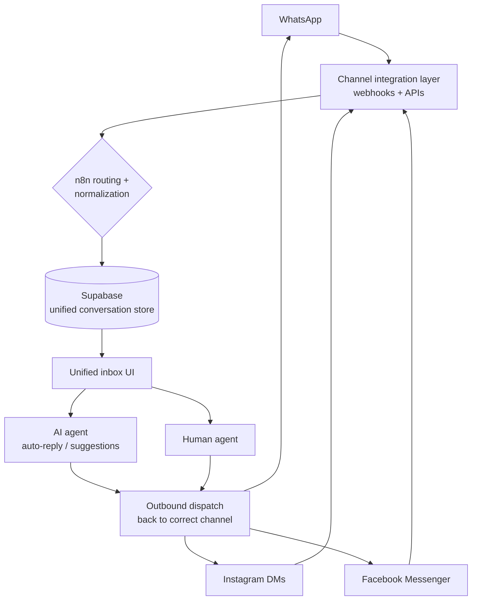

# Omnichannel CRM with Unified Inbox

**Role:** Full-Stack AI Engineer &nbsp;|&nbsp; **Domain:** SMB SaaS &nbsp;|&nbsp; **Status:** Production

---

## The problem

Small businesses lose customers in the gaps between channels. Messages arrive on WhatsApp, Instagram, and Facebook simultaneously, each in its own app, each with its own login. Teams miss messages, reply slowly, and have no single view of a customer conversation. Off-the-shelf CRMs are heavy, expensive, and rarely unify social DMs the way SMBs actually need.

## The solution

A **full-stack omnichannel CRM** built around a **single unified inbox**. Messages from WhatsApp, Instagram, and Facebook flow into one surface where **both AI and human agents** can respond, on any channel, without ever leaving the platform. Built on a clean, modern front-end over a Supabase + n8n backbone.

## Architecture

## How it works

1. **Channel integration** &ndash; WhatsApp, Instagram, and Facebook connect through a webhook + API layer that captures every inbound message.
2. **Normalization &amp; routing** &ndash; n8n normalizes messages from different platforms into a single schema and writes them to Supabase as one continuous conversation per customer.
3. **Unified inbox** &ndash; A modern front-end shows every channel in one view; agents see full context regardless of where the message originated.
4. **AI + human response** &ndash; An AI agent can auto-respond or draft suggestions; human agents take over seamlessly. Outbound messages are dispatched back to the correct native channel.

## Impact

| Metric | Result |
|--------|--------|
| Channels unified | **3** (WhatsApp, Instagram, Facebook) in one inbox |
| Tabs / logins replaced | **3+ separate apps &rarr; 1 surface** |
| First-response time | **~60% faster** with AI auto-reply + suggestions *(illustrative)* |
| Agent model | AI and human agents on a single shared surface |

## Engineering decisions

- **One conversation schema:** normalizing every platform into a single model is what makes a true unified inbox possible, not three tabs in a trench coat.
- **AI as a teammate, not a wall:** AI handles first response and drafting, with frictionless human handoff to preserve trust.

---

> **Confidential.** Production source is proprietary and under NDA. A live, screen-shared walkthrough is available on request.

[&larr; Back to portfolio](../README.md)
