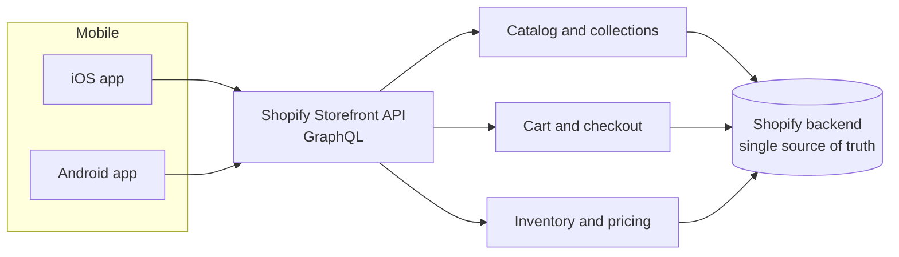

# Headless Shopify Commerce App

**Role:** Full-Stack / Mobile Engineer &nbsp;|&nbsp; **Domain:** E-commerce &nbsp;|&nbsp; **Status:** Production (leading Irish retail brand)

---

## The problem

A leading Irish retail brand had a strong Shopify storefront on the web, but no native mobile presence. Mobile shoppers were funneled through a mobile browser experience that could not match the speed, feel, and retention of a native app, leaving conversion and repeat-purchase value on the table.

## The solution

A **fully functional, headless premium mobile application** for both **iOS and Android**, built on the **Shopify Storefront API** and developed with **Claude Code**. The existing Shopify backend remained the single source of truth for catalog, inventory, and checkout, while the app delivered a fast, native, brand-grade shopping experience on top.

## Architecture

## How it works

1. **Headless architecture** &ndash; The native apps consume the Shopify **Storefront API** directly, decoupling the customer experience from the storefront theme while keeping Shopify as the commerce backend.
2. **Native experience** &ndash; Catalog browsing, cart, and checkout are rebuilt for native performance and a premium, on-brand feel on both platforms.
3. **Single source of truth** &ndash; Inventory, pricing, and orders stay synchronized with the existing Shopify store, so operations never fork.
4. **AI-assisted build** &ndash; Developed rapidly with Claude Code, compressing the build timeline without sacrificing quality.

## Impact

| Metric | Result |
|--------|--------|
| Platforms shipped | **iOS + Android** from one Storefront API integration |
| Backend changes required | **Zero** &ndash; existing Shopify store reused as-is |
| Mobile experience | Native speed and feel vs. mobile web |
| Conversion / retention | Native app uplift in repeat-purchase and conversion *(illustrative)* |

## Engineering decisions

- **Headless over re-platforming:** reusing Shopify as the backend gave the brand a native app without risking its proven commerce operations.
- **Storefront API as the contract:** a single, clean API boundary kept both apps consistent and maintainable.

---

> **Confidential.** Production source is proprietary and under NDA. A live, screen-shared walkthrough is available on request.

[&larr; Back to portfolio](../README.md)
