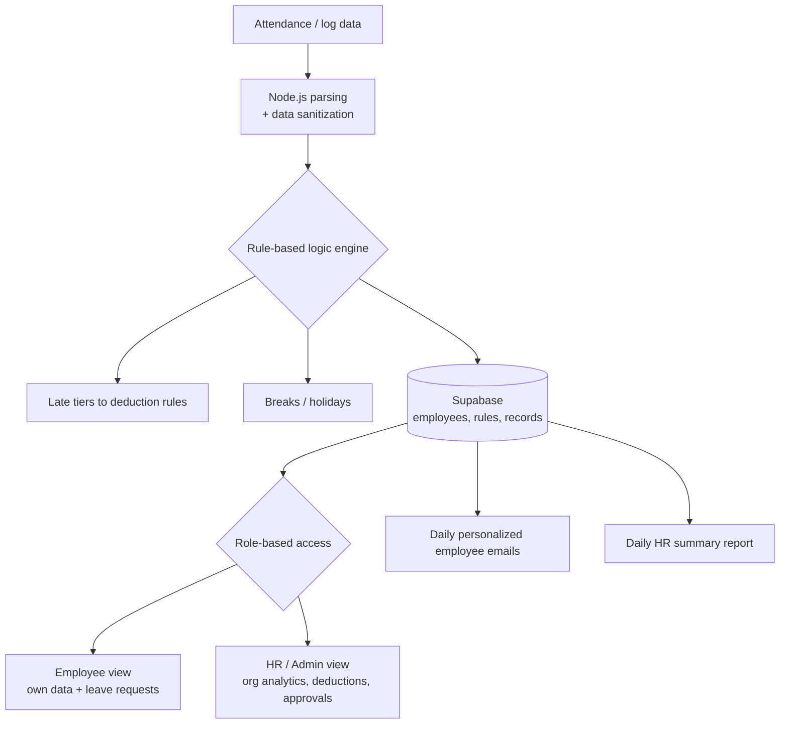

# Workforce Orchestration Engine

**Role:** Lead AI Automation Engineer &nbsp;|&nbsp; **Domain:** HR Operations &nbsp;|&nbsp; **Status:** Production (deployed across 2 enterprises)

---

## The problem

HR teams were manually pulling raw attendance logs, cleaning messy data, and hand-calculating late penalties and salary deductions for **100+ employees**. The process was slow, error-prone, opaque to employees, and repeated every single day across multiple companies.

## The solution

A **full workforce-management platform** on Supabase + n8n that ingests attendance data, applies **rule-based deduction logic**, enforces **role-based access**, and runs the entire daily reporting cycle automatically. Employees see only their own data and can request leave; HR and Admin see org-wide analytics, deductions, and approvals.

## Architecture

## How it works

1. **Ingestion &amp; sanitization** &ndash; A Node.js layer parses raw attendance data and strips noise into clean records.
2. **Rule-based engine** &ndash; Multi-tier logic translates lateness, breaks, and holidays into deterministic deductions, no human math required.
3. **Role-based access** &ndash; Employees see only their own data and can apply for leave; HR and Admin get org-wide analytics, deduction views, and one-click leave approvals.
4. **Automated reporting** &ndash; The system emails each employee a personalized daily summary and sends HR a consolidated daily report.

## Impact

| Metric | Result |
|--------|--------|
| Employees managed | **100+** across **2 enterprises** |
| Manual HR data handling | **~90% reduction** *(consistent with deployment outcomes)* |
| Payroll-deduction errors | **Near-zero** &ndash; deterministic rule engine replaces manual math |
| Access model | **RBAC** &ndash; employee vs. HR / Admin scoping |
| Reporting | **Automated daily** employee + HR emails |

## Engineering decisions

- **Deterministic rules over guesswork:** payroll demands exactness, so deductions run on explicit, auditable logic rather than an LLM.
- **RBAC from day one:** scoping data by role made the same platform safe for employees and managers alike.

---

> **Confidential.** Production source is proprietary and under NDA. A live, screen-shared walkthrough is available on request.

[&larr; Back to portfolio](../README.md)
